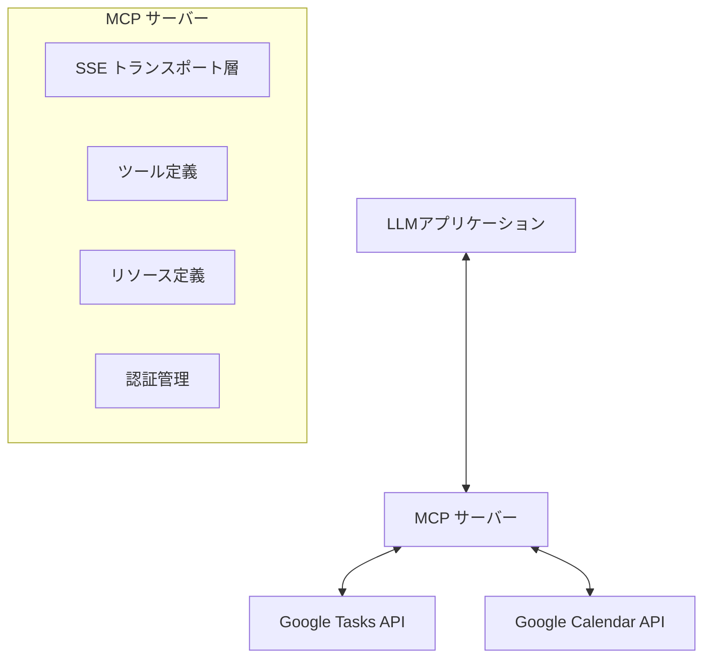
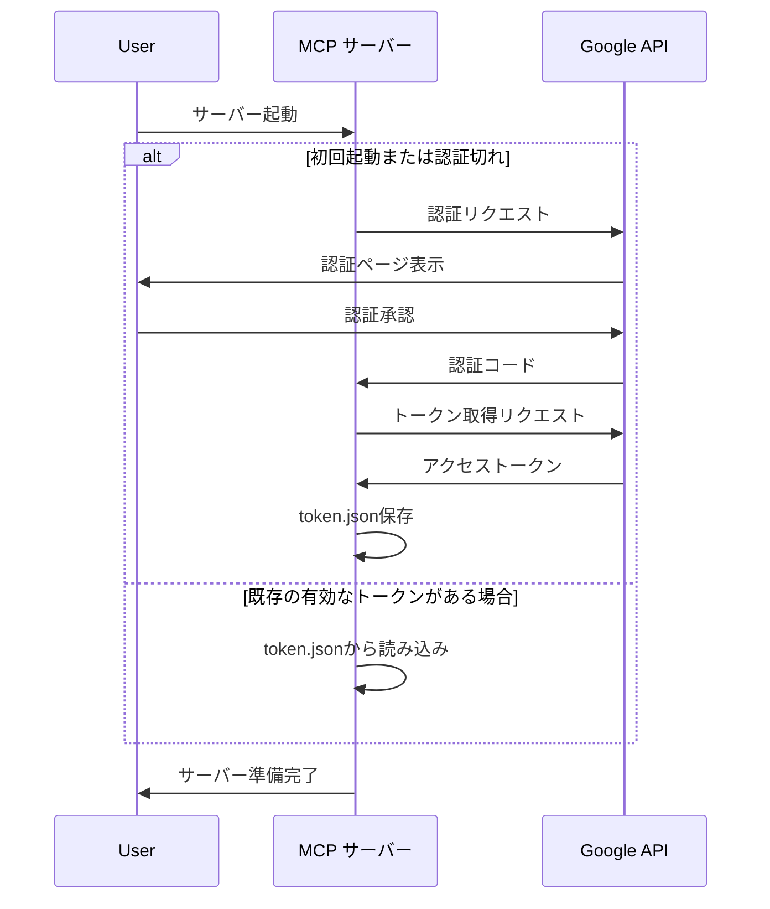

# SSE を利用した MCP サーバーの作成とタスク管理 API の実装

## 1. 概要

Model Context Protocol (MCP) を使用して、Google Tasks API と Google Calendar API を統合したタスク管理システムを実装します。この MCP サーバーは、SSE（Server-Sent Events）を利用して、LLM アプリケーションとの通信を行います。

## 2. 技術スタック

- **言語**: TypeScript
- **フレームワーク**: Express.js（HTTP サーバー用）
- **MCP SDK**: @modelcontextprotocol/sdk
- **認証**: OAuth 2.0（Google API 用）
- **API**: Google Tasks API、Google Calendar API

## 3. サーバー構造



## 4. 認証フロー



## 5. SSE を利用した MCP サーバーの実装

### 5.1 基本構造

```typescript
import express, { Request, Response } from "express";
import { McpServer } from "@modelcontextprotocol/sdk/server/mcp.js";
import { SSEServerTransport } from "@modelcontextprotocol/sdk/server/sse.js";
import { z } from "zod";
import { google } from "googleapis";
import fs from "fs";
import path from "path";

// OAuth2クライアント設定
const SCOPES = [
  "https://www.googleapis.com/auth/tasks",
  "https://www.googleapis.com/auth/calendar",
];
const TOKEN_PATH = path.join(process.cwd(), "token.json");
const CREDENTIALS_PATH = path.join(process.cwd(), "credentials.json");

// MCPサーバー初期化
const server = new McpServer({
  name: "Google Tasks & Calendar Manager",
  version: "1.0.0",
});

// Expressアプリケーション
const app = express();
const port = 3000;

// セッション管理用オブジェクト
const transports: { [sessionId: string]: SSEServerTransport } = {};

// SSEエンドポイント
app.get("/sse", async (_: Request, res: Response) => {
  const transport = new SSEServerTransport("/messages", res);
  transports[transport.sessionId] = transport;

  res.on("close", () => {
    delete transports[transport.sessionId];
  });

  await server.connect(transport);
});

// メッセージ受信エンドポイント
app.post("/messages", async (req: Request, res: Response) => {
  const sessionId = req.query.sessionId as string;
  const transport = transports[sessionId];

  if (transport) {
    await transport.handlePostMessage(req, res);
  } else {
    res.status(400).send("No transport found for sessionId");
  }
});

// サーバー起動
app.listen(port, () => {
  console.log(`MCP server running at http://localhost:${port}`);
});
```

### 5.2 認証処理

```typescript
// 認証関連の関数
async function authorize() {
  let client = await loadSavedCredentialsIfExist();
  if (client) {
    return client;
  }
  client = await authenticate();
  if (client.credentials) {
    await saveCredentials(client);
  }
  return client;
}

async function loadSavedCredentialsIfExist() {
  try {
    const content = fs.readFileSync(TOKEN_PATH, "utf8");
    const credentials = JSON.parse(content);
    return google.auth.fromJSON(credentials);
  } catch (err) {
    return null;
  }
}

async function saveCredentials(client) {
  const content = fs.readFileSync(CREDENTIALS_PATH, "utf8");
  const keys = JSON.parse(content);
  const key = keys.installed || keys.web;
  const payload = JSON.stringify({
    type: "authorized_user",
    client_id: key.client_id,
    client_secret: key.client_secret,
    refresh_token: client.credentials.refresh_token,
  });
  fs.writeFileSync(TOKEN_PATH, payload);
}

async function authenticate() {
  const content = fs.readFileSync(CREDENTIALS_PATH, "utf8");
  const keys = JSON.parse(content);
  const key = keys.installed || keys.web;
  const oAuth2Client = new google.auth.OAuth2(
    key.client_id,
    key.client_secret,
    key.redirect_uris[0]
  );

  // 認証URLを生成
  const authUrl = oAuth2Client.generateAuthUrl({
    access_type: "offline",
    scope: SCOPES,
  });
  console.log("Authorize this app by visiting this url:", authUrl);

  // ここでユーザーに認証コードを入力してもらう処理
  // 実際の実装では、Webサーバーでリダイレクトを受け取るか、
  // コンソール入力などで対応する

  // 認証コードからトークンを取得
  const code = "認証コード"; // ユーザー入力から取得
  const { tokens } = await oAuth2Client.getToken(code);
  oAuth2Client.setCredentials(tokens);

  return oAuth2Client;
}
```

## 6. タスク管理 API を MCP サーバーの tool として実装

### 6.1 ツール定義

```typescript
// 認証クライアント初期化
let authClient;
authorize()
  .then((client) => {
    authClient = client;

    // Google APIクライアント初期化
    const tasksClient = google.tasks({ version: "v1", auth: authClient });
    const calendarClient = google.calendar({ version: "v3", auth: authClient });

    // ツール定義
    defineTools(server, tasksClient, calendarClient);
  })
  .catch(console.error);

function defineTools(server, tasksClient, calendarClient) {
  // タスク一覧取得ツール
  server.tool(
    "listTasks",
    {
      status: z.enum(["needsAction", "completed"]).optional(),
      dueMin: z.string().optional(),
      dueMax: z.string().optional(),
      maxResults: z.number().optional(),
      pageToken: z.string().optional(),
    },
    async ({ status, dueMin, dueMax, maxResults, pageToken }) => {
      try {
        const response = await tasksClient.tasks.list({
          tasklist: "@default",
          status,
          dueMin,
          dueMax,
          maxResults,
          pageToken,
        });

        return {
          content: [
            {
              type: "text",
              text: JSON.stringify(response.data, null, 2),
            },
          ],
        };
      } catch (error) {
        return {
          content: [
            {
              type: "text",
              text: `Error: ${error.message}`,
            },
          ],
          isError: true,
        };
      }
    }
  );

  // タスク取得ツール
  server.tool(
    "getTask",
    {
      taskId: z.string(),
    },
    async ({ taskId }) => {
      try {
        const response = await tasksClient.tasks.get({
          tasklist: "@default",
          task: taskId,
        });

        return {
          content: [
            {
              type: "text",
              text: JSON.stringify(response.data, null, 2),
            },
          ],
        };
      } catch (error) {
        return {
          content: [
            {
              type: "text",
              text: `Error: ${error.message}`,
            },
          ],
          isError: true,
        };
      }
    }
  );

  // タスク作成ツール
  server.tool(
    "createTask",
    {
      title: z.string(),
      notes: z.string().optional(),
      due: z.string().optional(),
      status: z.enum(["needsAction", "completed"]).optional(),
      parent: z.string().optional(),
    },
    async ({ title, notes, due, status, parent }) => {
      try {
        const response = await tasksClient.tasks.insert({
          tasklist: "@default",
          requestBody: {
            title,
            notes,
            due,
            status,
            parent,
          },
        });

        return {
          content: [
            {
              type: "text",
              text: JSON.stringify(response.data, null, 2),
            },
          ],
        };
      } catch (error) {
        return {
          content: [
            {
              type: "text",
              text: `Error: ${error.message}`,
            },
          ],
          isError: true,
        };
      }
    }
  );

  // タスク更新ツール
  server.tool(
    "updateTask",
    {
      taskId: z.string(),
      title: z.string().optional(),
      notes: z.string().optional(),
      due: z.string().optional(),
      status: z.enum(["needsAction", "completed"]).optional(),
      completed: z.string().optional(),
    },
    async ({ taskId, title, notes, due, status, completed }) => {
      try {
        const response = await tasksClient.tasks.update({
          tasklist: "@default",
          task: taskId,
          requestBody: {
            title,
            notes,
            due,
            status,
            completed,
          },
        });

        return {
          content: [
            {
              type: "text",
              text: JSON.stringify(response.data, null, 2),
            },
          ],
        };
      } catch (error) {
        return {
          content: [
            {
              type: "text",
              text: `Error: ${error.message}`,
            },
          ],
          isError: true,
        };
      }
    }
  );

  // タスク削除ツール
  server.tool(
    "deleteTask",
    {
      taskId: z.string(),
    },
    async ({ taskId }) => {
      try {
        await tasksClient.tasks.delete({
          tasklist: "@default",
          task: taskId,
        });

        return {
          content: [
            {
              type: "text",
              text: JSON.stringify(
                { success: true, message: "Task deleted successfully" },
                null,
                2
              ),
            },
          ],
        };
      } catch (error) {
        return {
          content: [
            {
              type: "text",
              text: `Error: ${error.message}`,
            },
          ],
          isError: true,
        };
      }
    }
  );

  // イベント一覧取得ツール
  server.tool(
    "listEvents",
    {
      timeMin: z.string().optional(),
      timeMax: z.string().optional(),
      calendarId: z.string().optional().default("primary"),
      maxResults: z.number().optional(),
      pageToken: z.string().optional(),
      timeZone: z.string().optional(),
    },
    async ({
      timeMin,
      timeMax,
      calendarId,
      maxResults,
      pageToken,
      timeZone,
    }) => {
      try {
        const response = await calendarClient.events.list({
          calendarId,
          timeMin,
          timeMax,
          maxResults,
          pageToken,
          timeZone,
        });

        return {
          content: [
            {
              type: "text",
              text: JSON.stringify(response.data, null, 2),
            },
          ],
        };
      } catch (error) {
        return {
          content: [
            {
              type: "text",
              text: `Error: ${error.message}`,
            },
          ],
          isError: true,
        };
      }
    }
  );

  // イベント取得ツール
  server.tool(
    "getEvent",
    {
      eventId: z.string(),
      calendarId: z.string().optional().default("primary"),
      timeZone: z.string().optional(),
    },
    async ({ eventId, calendarId, timeZone }) => {
      try {
        const response = await calendarClient.events.get({
          calendarId,
          eventId,
          timeZone,
        });

        return {
          content: [
            {
              type: "text",
              text: JSON.stringify(response.data, null, 2),
            },
          ],
        };
      } catch (error) {
        return {
          content: [
            {
              type: "text",
              text: `Error: ${error.message}`,
            },
          ],
          isError: true,
        };
      }
    }
  );

  // イベント作成ツール
  server.tool(
    "createEvent",
    {
      summary: z.string(),
      description: z.string().optional(),
      location: z.string().optional(),
      start: z.object({
        dateTime: z.string(),
        timeZone: z.string(),
      }),
      end: z.object({
        dateTime: z.string(),
        timeZone: z.string(),
      }),
      recurrence: z.array(z.string()).optional(),
      attendees: z
        .array(
          z.object({
            email: z.string(),
            displayName: z.string().optional(),
          })
        )
        .optional(),
      reminders: z
        .object({
          useDefault: z.boolean(),
          overrides: z
            .array(
              z.object({
                method: z.string(),
                minutes: z.number(),
              })
            )
            .optional(),
        })
        .optional(),
      colorId: z.string().optional(),
      calendarId: z.string().optional().default("primary"),
    },
    async ({
      summary,
      description,
      location,
      start,
      end,
      recurrence,
      attendees,
      reminders,
      colorId,
      calendarId,
    }) => {
      try {
        const response = await calendarClient.events.insert({
          calendarId,
          requestBody: {
            summary,
            description,
            location,
            start,
            end,
            recurrence,
            attendees,
            reminders,
            colorId,
          },
        });

        return {
          content: [
            {
              type: "text",
              text: JSON.stringify(response.data, null, 2),
            },
          ],
        };
      } catch (error) {
        return {
          content: [
            {
              type: "text",
              text: `Error: ${error.message}`,
            },
          ],
          isError: true,
        };
      }
    }
  );

  // タスクとイベントの紐付け関連ツール
  // TaskEventLinkの管理用データストア（実際の実装ではデータベースを使用）
  const taskEventLinks = [];

  // 紐付け作成ツール
  server.tool(
    "createTaskEventLink",
    {
      taskId: z.string(),
      eventId: z.string(),
      notes: z.string().optional(),
    },
    async ({ taskId, eventId, notes }) => {
      try {
        // タスクとイベントの存在確認
        await tasksClient.tasks.get({
          tasklist: "@default",
          task: taskId,
        });

        await calendarClient.events.get({
          calendarId: "primary",
          eventId,
        });

        // 紐付け情報作成
        const link = {
          id: `link_${Date.now()}`,
          taskId,
          eventId,
          userId: "current_user", // 実際の実装では認証ユーザーIDを使用
          createdAt: new Date().toISOString(),
          updatedAt: new Date().toISOString(),
          notes,
        };

        taskEventLinks.push(link);

        return {
          content: [
            {
              type: "text",
              text: JSON.stringify(link, null, 2),
            },
          ],
        };
      } catch (error) {
        return {
          content: [
            {
              type: "text",
              text: `Error: ${error.message}`,
            },
          ],
          isError: true,
        };
      }
    }
  );

  // 紐付け一覧取得ツール
  server.tool(
    "listTaskEventLinks",
    {
      taskId: z.string().optional(),
      eventId: z.string().optional(),
      maxResults: z.number().optional(),
      pageToken: z.string().optional(),
    },
    async ({ taskId, eventId, maxResults, pageToken }) => {
      try {
        let filteredLinks = taskEventLinks;

        if (taskId) {
          filteredLinks = filteredLinks.filter(
            (link) => link.taskId === taskId
          );
        }

        if (eventId) {
          filteredLinks = filteredLinks.filter(
            (link) => link.eventId === eventId
          );
        }

        // ページネーション処理（簡易実装）
        const startIndex = pageToken ? parseInt(pageToken) : 0;
        const endIndex = maxResults
          ? startIndex + maxResults
          : filteredLinks.length;
        const paginatedLinks = filteredLinks.slice(startIndex, endIndex);

        const nextPageToken =
          endIndex < filteredLinks.length ? endIndex.toString() : undefined;

        return {
          content: [
            {
              type: "text",
              text: JSON.stringify(
                {
                  items: paginatedLinks,
                  nextPageToken,
                },
                null,
                2
              ),
            },
          ],
        };
      } catch (error) {
        return {
          content: [
            {
              type: "text",
              text: `Error: ${error.message}`,
            },
          ],
          isError: true,
        };
      }
    }
  );
}
```

## 7. リソース定義

```typescript
// リソース定義
function defineResources(server, tasksClient, calendarClient) {
  // タスク一覧リソース
  server.resource(
    "tasks",
    new ResourceTemplate(
      "tasks://list{?status,dueMin,dueMax,maxResults,pageToken}",
      {
        list: async () => {
          const response = await tasksClient.tasks.list({
            tasklist: "@default",
          });

          return {
            resources: response.data.items.map((task) => ({
              uri: `tasks://task/${task.id}`,
              name: task.title,
            })),
          };
        },
      }
    ),
    async (uri, variables) => {
      const { status, dueMin, dueMax, maxResults, pageToken } = variables;

      const response = await tasksClient.tasks.list({
        tasklist: "@default",
        status,
        dueMin,
        dueMax,
        maxResults: maxResults ? parseInt(maxResults) : undefined,
        pageToken,
      });

      return {
        contents: [
          {
            uri: uri.toString(),
            text: JSON.stringify(response.data, null, 2),
          },
        ],
      };
    }
  );

  // 特定のタスクリソース
  server.resource(
    "task",
    new ResourceTemplate("tasks://task/{taskId}", {
      list: undefined,
    }),
    async (uri, { taskId }) => {
      const response = await tasksClient.tasks.get({
        tasklist: "@default",
        task: taskId,
      });

      return {
        contents: [
          {
            uri: uri.toString(),
            text: JSON.stringify(response.data, null, 2),
          },
        ],
      };
    }
  );

  // イベント一覧リソース
  server.resource(
    "events",
    new ResourceTemplate(
      "events://list{?timeMin,timeMax,calendarId,maxResults,pageToken,timeZone}",
      {
        list: async () => {
          const response = await calendarClient.events.list({
            calendarId: "primary",
          });

          return {
            resources: response.data.items.map((event) => ({
              uri: `events://event/${event.id}`,
              name: event.summary,
            })),
          };
        },
      }
    ),
    async (uri, variables) => {
      const {
        timeMin,
        timeMax,
        calendarId = "primary",
        maxResults,
        pageToken,
        timeZone,
      } = variables;

      const response = await calendarClient.events.list({
        calendarId,
        timeMin,
        timeMax,
        maxResults: maxResults ? parseInt(maxResults) : undefined,
        pageToken,
        timeZone,
      });

      return {
        contents: [
          {
            uri: uri.toString(),
            text: JSON.stringify(response.data, null, 2),
          },
        ],
      };
    }
  );

  // 特定のイベントリソース
  server.resource(
    "event",
    new ResourceTemplate("events://event/{eventId}{?calendarId,timeZone}", {
      list: undefined,
    }),
    async (uri, { eventId, calendarId = "primary", timeZone }) => {
      const response = await calendarClient.events.get({
        calendarId,
        eventId,
        timeZone,
      });

      return {
        contents: [
          {
            uri: uri.toString(),
            text: JSON.stringify(response.data, null, 2),
          },
        ],
      };
    }
  );
}
```

## 8. プロジェクト構造

```
ai-scheduler-mcp/
├── src/
│   ├── index.ts           # メインエントリーポイント
│   ├── auth.ts            # 認証関連の処理
│   ├── tools/
│   │   ├── tasks.ts       # タスク関連のツール定義
│   │   ├── events.ts      # イベント関連のツール定義
│   │   └── links.ts       # 紐付け関連のツール定義
│   ├── resources/
│   │   ├── tasks.ts       # タスク関連のリソース定義
│   │   ├── events.ts      # イベント関連のリソース定義
│   │   └── links.ts       # 紐付け関連のリソース定義
│   └── models/
│       ├── task.ts        # タスクモデル
│       ├── event.ts       # イベントモデル
│       └── link.ts        # 紐付けモデル
├── package.json
├── tsconfig.json
├── credentials.json       # Google API認証情報（gitignore対象）
└── token.json             # 認証トークン（gitignore対象）
```

## 9. 実装上の考慮事項

1. **エラーハンドリング**:

   - すべての API リクエストは適切なエラーハンドリングを行い、MCP のエラー形式に合わせて返す
   - ネットワークエラーや認証エラーなど、様々なエラーケースに対応

2. **タイムゾーン処理**:

   - すべての日時データは RFC 3339 形式で扱う
   - クライアント側とサーバー側の両方でタイムゾーン変換を適切に処理

3. **セキュリティ**:

   - 認証情報は安全に管理し、gitignore に追加
   - 必要最小限のスコープのみを要求

4. **パフォーマンス**:

   - 大量のデータを扱う場合はページネーションを実装
   - 頻繁にアクセスされるデータをキャッシュ

5. **同期**:
   - Google Tasks と Google Calendar の変更をリアルタイムで反映するための同期メカニズム

## 10. クライアント側の使用例

```typescript
// Claude Desktopの設定例
{
  "mcpServers": {
    "ai-scheduler": {
      "command": "node",
      "args": ["dist/index.js"],
      "cwd": "/path/to/ai-scheduler-mcp"
    }
  }
}
```

この実装ガイドに従うことで、SSE を利用した MCP サーバーを作成し、Google Tasks と Google Calendar API を統合したタスク管理システムを実現できます。
